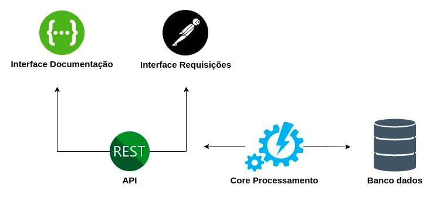
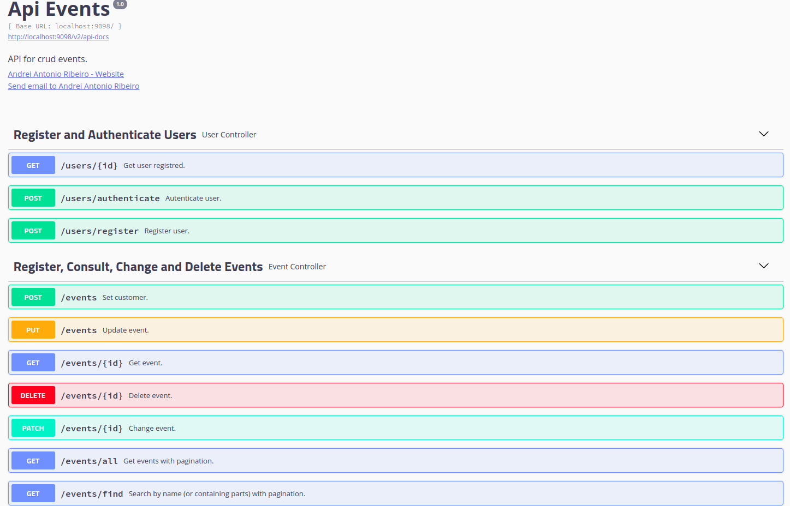

# Api Crud Events

Este projeto tem como objetivo realizar a criação e autenticação de usuários, e o CRUD de eventos.

O serviço é executado com Spring Boot e conta com endpoint's RestFull, testes de integração com MockMvc, persistência de dados com JPA/MongoDB, autenticação JWT e documentação de api com Swagger.

O processo de authorization é feito via header com <code>Bearer token</code>

O sistema está disponível em https://events-nkay.herokuapp.com/swagger-ui.html#/

#### 1) Formas de execução do sistema e testes de integração.

   ##### Executar com Jar 
   ><code>java -jar eventsApi-0.0.1-SNAPSHOT.jar</code>

   ##### Executar testes integração 
   ><code>mvn test</code>

#### 2) Arquitetura de funcionamento do sistema.

#### 3) Interface de documentação
><code> http://localhost:9098/swagger-ui.html#/</code>

#### 4) Interface de requisições
><code>[PostmanCollection.json](Nkay-Events.postman_collection.json)</code>
